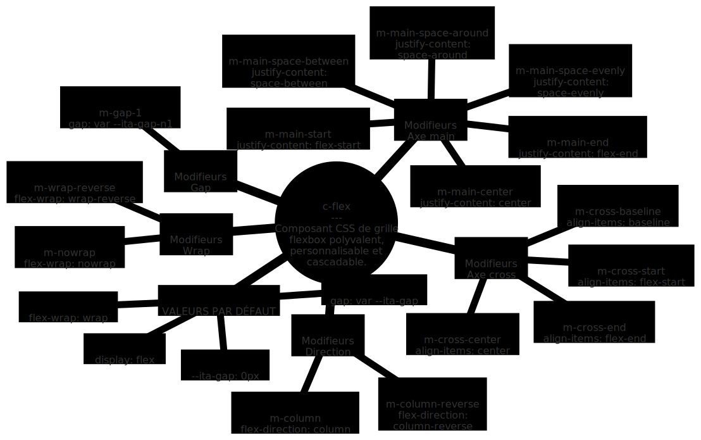

# c-flex.scss

[Démo et documentation](https://ita-design-system.github.io/c-flex.scss/)

Composant générique CSS c-flex du système de design IT Automotive.



## Typologie d'un composant générique

```scss
// SCSS map
$briks-components-generic: ( 
    // SCSS map | Nom du composant
    NOM_DU_COMPOSANT: ( 
        // Boolean | Composant activé true ou false
        enabled: true, 
        // Boolean | Responsive activé true ou false
        responsive: true, 
        // SCSS map | Liste des propriétés du composant par défaut (c-flex seul)
        defaults: (), 
        // SCSS map | Liste des modifieurs
        modifiers: () 
    )
);
```

## Configuration

Organisation et description du fichier de configuration [_sass/_flex_generic.scss](_sass/_flex_generic.scss).

```scss
/*
    C-FLEX
    v0.1.0
    Composant générique CSS ITADS
    https://github.com/ita-design-system/c-flex.scss
*/
// SCSS map
$briks-components-generic: ( 
    // Nom du composant
    flex: ( 
        // Composant activé true ou false
        enabled: true, 
        // Responsive activé true ou false
        responsive: true, 
        // Liste des propriétés c-flex par défaut
        defaults: ( 
            --ita-gap: 0px,
            gap: var(--ita-gap),
            display: flex,
            flex-wrap: wrap,
        ),
        // Rendu: 
        // c-flex {
        //     --ita-gap: 0px,
        //     gap: var(--ita-gap),
        //     display: flex,
        //     flex-wrap: wrap,
        // }
        // Liste des modifieurs contenant chacun une liste de propriétés qui 
        // soit surchargent les propriétés par défaut
        // soit ajoutent des propriétés
        // soit les deux
        modifiers: ( 
            // Type de flex
            // c-flex m-inline-flex
            inline-flex: (
                display: inline-flex
            ),
            // Axe main
            // c-flex m-main-start
            main-start: ( 
                justify-content: flex-start
            ),
            // c-flex m-main-center
            main-center: ( 
                justify-content: center
            ),
            // c-flex m-main-end
            main-end: ( // c-flex m-main-end
                justify-content: flex-end
            ),
            // c-flex m-main-space-between
            main-space-between: ( 
                justify-content: space-between
            ),
            // c-flex m-main-space-around
            main-space-around: ( 
                justify-content: space-around
            ),
            // c-flex m-main-space-evenly
            main-space-evenly: ( 
                justify-content: space-evenly
            ),
            // Axe cross
            // c-flex m-cross-center
            cross-center: ( 
                align-items: center
            ),
            // c-flex m-cross-baseline
            cross-baseline: ( 
                align-items: baseline
            ),
            // c-flex m-cross-start
            cross-start: ( 
                align-items: flex-start
            ),
            // c-flex m-cross-end
            cross-end: ( 
                align-items: flex-end
            ),
            // Wrap / retour à la ligne
            // c-flex m-nowrap
            nowrap: ( 
                flex-wrap: nowrap
            ),
            // Direction
            // c-flex m-column
            column: ( 
                flex-direction: column
            ),
            // c-flex m-column-reverse
            column-reverse: ( 
                flex-direction: column-reverse
            ),
            // c-flex m-cross-row-reverse
            row-reverse: ( 
                flex-direction: row-reverse
            )
        )
    )
);
``` 

## Extensions

Il est possible d'étendre les fonctionnalités du composant en ajoutant simplement un point d'entrée avec une déclaration `$briks-components-generic` à la typologie identique mais avec des propriétés par défaut et des modifieurs qui surchargent ou ajoutent des propriétés CSS.

L'exemple suivant reprend la logique de l'extension de composant en y ajoutant des gaps flexbox.

```scss
/*
    C-FLEX EXTENSION
    Extension du composant générique c-flex
    https://github.com/ita-design-system/c-flex.scss
    Ce fichier doit servir à étendre ou surcharger les fonctionnalités
    du composant c-flex selon les besoins du projet
*/
$briks-components-generic: (
    // Nom du composant, obligatoirement flex
    flex: ( 
        // Extension activée true ou false
        enabled: true, 
        // Responsive activée true ou false pour l'extension
        responsive: true, 
        // Valeurs par défaut de l'extension
        defaults: (),
        // Liste des modifieurs contenant chacun une liste de propriétés qui 
        // soit surchargent les propriétés par défaut
        // soit ajoutent des propriétés
        // soit les deux
        modifiers: ( 
            // Gap
            // Surcharge de la variable CSS --ita-gap pour compatibilité avec c-dim
            gap-1: ( // c-flex m-gap-1
                --ita-gap: my-spacing(2)
            ),
            gap-2: ( // c-flex m-gap-2
                --ita-gap: my-spacing(4)
            ),
            gap-3: ( // c-flex m-gap-3
                --ita-gap: my-spacing(8)
            )
        )
    )
);
```
